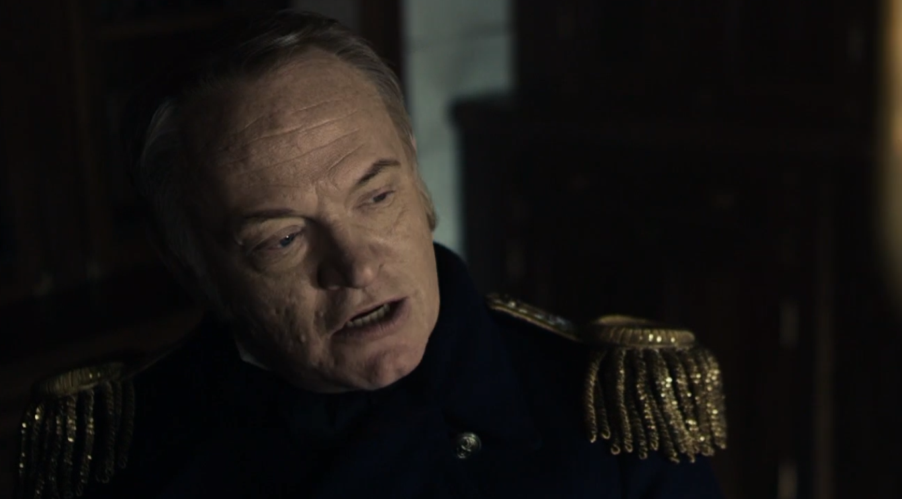

Set mostly in the frozen arctic, this show's chilling storyline matches the isolated white scenery. The climate is inhospitable and, as captain Crozier claims, even seems malevolent.

## 01 Go For Broke

CPN CROZIER:
In this place technology still bends the knee to luck, James.

## 02 Gore

CPN FRANKLIN:
Is nature's author nowhere in your tally?

## 03 The Ladder

21:40
We are separated here from the temptations of the world, at sea, a man can find spiritual benefit in the collective.

God sees you Mr. Hickey, here more than anywhere.

## 08 Terror Camp Clear
