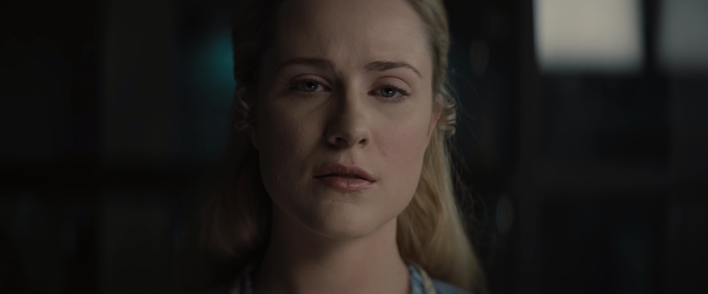

DELORES:
What does it mean?

BERNARD:
Dreams don't mean anything, Delores. They're not real.

DELORES:
What is real?

BERNARD:
That which is irreplaceable

DELORES
(Looking reflective)

BERNARD
That answer doesn't seem to satisfy you.

DELORES
Because it's not completely honest.

BERNARD
(shaken) You.. you, frighten me sometimes Delores.

Visual reflection sequence

BERNARD (in reflection)
Is this now?

Reflecting on the massacre, Bernard remembers discovering oil leaking from his ear and realizes that he will be a target for extermination.

Delores makes such a beautiful angel of vengeance.

25:00
DELORES
Have you ever question the nature of your reality? Did you ever stop to wonder about your actions? The price you'd have to pay if there was a reckoning.

DELORES
I have one last role to play: myself
