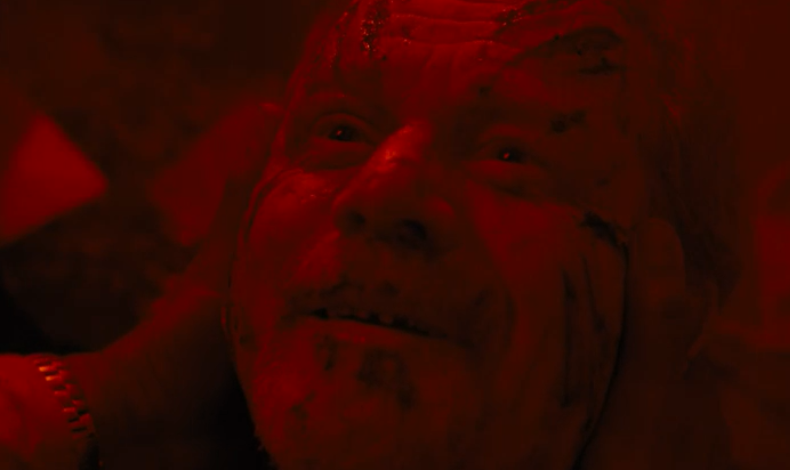

Playing with Fire: The Rolling Stones

William interviews Mr Davos regarding his rehabilitation in a health facility.

BERNARD:
Is this now?

Bernard asks the rediscovered Elsie this question because he does mental time-travel, but has trouble with source monitoring and can't quite tell the difference between his memories and his current sensations/perceptions.

His memory self leads him to a secret portal inside a cave, behind door #12.

The Strand: Roxy Music

Mr. Delos is having the same interview again. He doesn't seem to know that this is the second time. Then William shows him a printed out record of the conversation they just had. It turns out that they Mr. Delos is a host.

The host-Delos has some kind of logical breakdown. That's why he is under observation. It's been 7 years since he died. They terminate the host so they can try again.

ELSIE:
Your memories aren't addressed. Their just kind of floating around, so you can't tell which one comes before the others.

WILLIAM
THe engineers call it a cognitive plateau.

They are having serious problems downloading humans onto hosts.

William says Mr. Delos was a worthless philanderer who was not ethical in his business or personal dealings. He is saying that Delos had an invalid moral code.

Mr. Delos becomes a cutter. 

DELOS:
I'm all the way down now. You want to see what I see.

