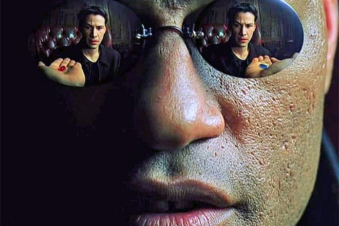

# Morality

LOST and The Matrix take two widely different views of the transcendent moral question. There is always a choice before us. Our choice is not predetermined. We end up making a decision regarding these questions, and the revelation is to know this.

## The Fundamental Question

  
## LOST

> There are two sides, two players. One is light, the other dark.

## The Matrix

> This is your last chance. After this, there is no turning back. You take the blue pill - the story ends, you wake up in your bed and believe whatever you want to believe. You take the red pill - you stay in Wonderland and I show you how deep the rabbit-hole goes.
